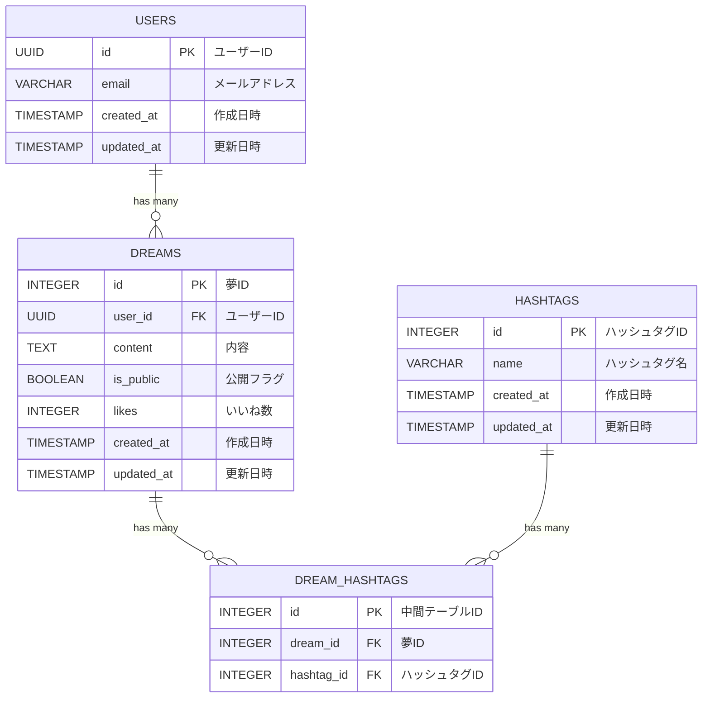

# Dream Base

書き溜めた夢を公開して「いいね！」がもらえるWebサービス

- [サービスのリンク](https://dream-base.vercel.app/)
- [API 仕様書](https://js-ninjaaaa.github.io/dream-base/)
- テストユーザー

| 項目         | 値                        |
|------------|-------------------------|
| メールアドレス | `testuser1@example.com` |
| パスワード   | `password1`                |

## 機能一覧

- ログイン
    - [x] メールアドレス & パスワード
    - [x] Xアカウント
        - メールアドレス登録済みに限る
- 自分の夢
    - [x] 夢の作成
    - [x] 夢の閲覧
    - [ ] 夢の編集
    - [X] 夢の削除
    - [x] 公開 or 非公開設定
- 公開されている夢
    - [x] 夢の閲覧
    - [x] 夢の絞り込み
    - [x] いいね！

## 画面

自分の夢画面

<image src="https://github.com/user-attachments/assets/28661240-0055-4fb3-ac6a-8c6980f4754c" width="700">

みんなの夢画面

<image src="https://github.com/user-attachments/assets/381ef3fa-c2d7-4d98-b451-0169a1303d99" width="700">

## 技術スタック

| カテゴリ       | 技術                                        | 
| -------------- | ------------------------------------------- | 
| フロントエンド | React, React Router, Tailwind CSS, Radix UI, Jotai | 
| バックエンド   | Flask, Pydantic                                    | 
| データベース   | Supabase                                  | 

## ER図

