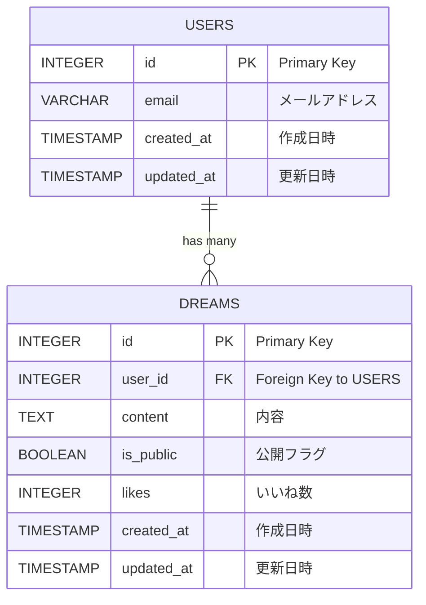

# Dream Sink

書き溜めた夢を公開して「いいね！」がもらえるWebサービス

- [サービスのリンク](https://dreamsink.vercel.app/)
- [API 仕様書](https://js-ninjaaaa.github.io/dreamsink/)
- テストユーザー

| 項目         | 値                        |
|------------|-------------------------|
| メールアドレス | `testuser1@example.com` |
| パスワード   | `password`                |

## 機能一覧

- 自分の夢
    - [x] 夢の作成
    - [x] 夢の閲覧
    - [ ] 夢の編集
    - [X] 夢の削除
    - [x] 公開 or 非公開設定
- 公開されている夢
    - [x] 夢の閲覧
    - [ ] 夢の絞り込み
    - [x] いいね！

## 画面

自分の夢画面

<image src="https://github.com/user-attachments/assets/9ba573db-10b1-422a-bb93-8c848bd5ab35" width="700">

みんなの夢画面

<image src="https://github.com/user-attachments/assets/e6e237da-abbd-4704-8b09-a3105d8e335d" width="700">

## 技術スタック

| カテゴリ       | 技術                                        | 
| -------------- | ------------------------------------------- | 
| フロントエンド | React, React Router, Tailwind CSS, Radix UI, Jotai | 
| バックエンド   | Flask                                       | 
| データベース   | Supabase                                  | 

## ER図

